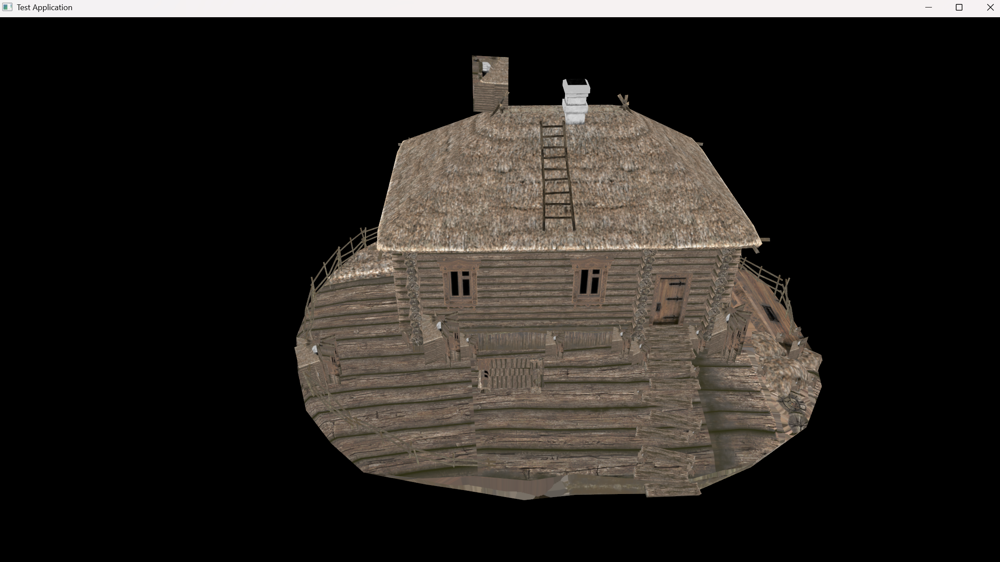

# XarEngine - my game engine

## About engine
It's my own game engine in its early and dirty state. I develop it when I have a mood and time to do so. I do it to
learn about C++, computer graphics, algorithms, testing etc. - so in general to develop my skills.

Number of features it rather tiny, but I did not spend much time on development yet (take a look on my github account
activity). At the moment there are tests and a simple demo app which allows to render a rotating model using Vulkan API.
Application user can switch from one model to the other by pressing 1 or 2 on the keyboard.

Sample screenshot from the demo app:


## Build
Example debug build commands:

```
conan install . -pr config/conan/profiles/windows_x86_64-gcc11 --build=missing -s build_type=Debug
cmake --preset conan-debug
cmake --build --preset conan-debug
```

## About me
michal.wendel@gmail.com